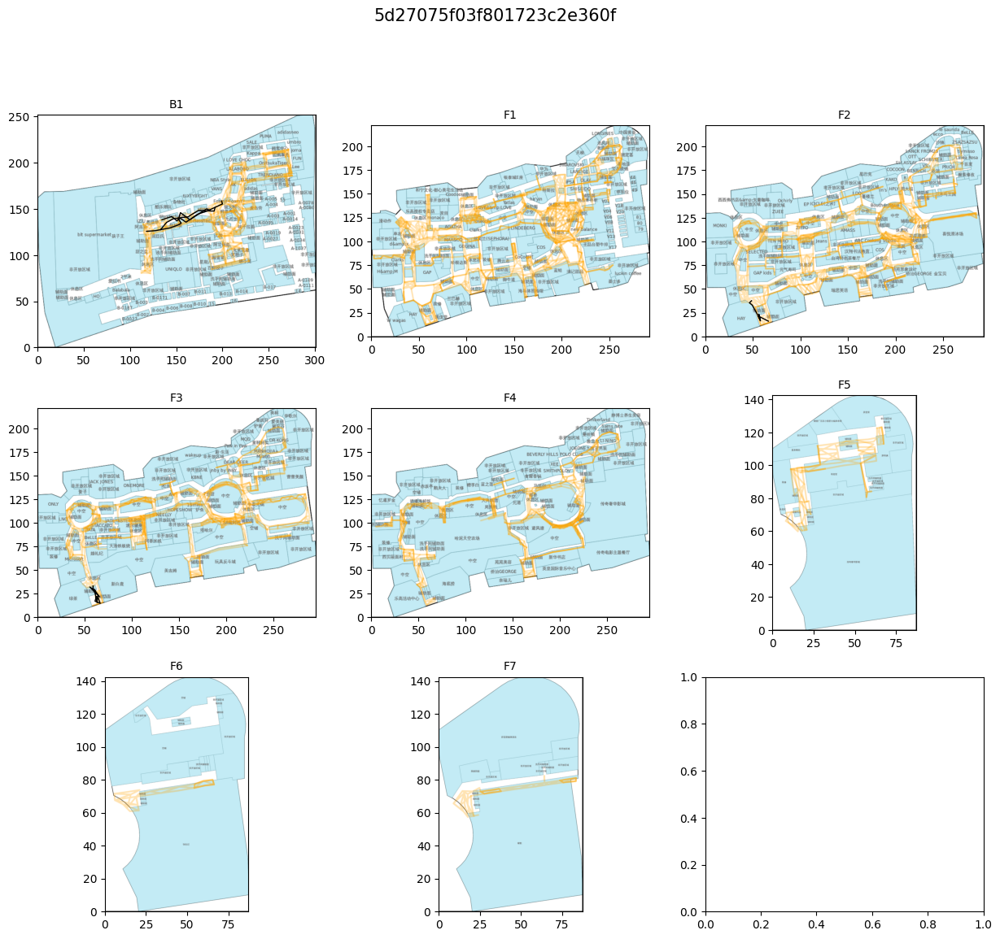

  

# kaggle-Indoor-Location-and-Navigation

[Indoor-Location-and-Navigation](https://www.kaggle.com/c/indoor-location-navigation/overview) コンペのリポジトリ

デバッグ実行: `ipython3 --pdb exp.py`  
docker build: `sh build_docker.sh`  
docker run: `sh run_docker.sh -p 8713 -g 0`  
	- gpu使わない場合は `-g -1` とする

## Links
- [model mindmap](https://drive.mindmup.com/map/1WJZQxXyaOuGKm-UtM4yi_fX8l2jtjtCE)
- [googledrive](https://drive.google.com/drive/u/1/folders/1lFPbS1gHwJabM4CTQju0tiJaJJxHnmEe)
- [issue board](https://github.com/fkubota/kaggle-Indoor-Location-and-Navigation/projects/1)
- [team issue](https://github.com/sinchir0/indoor/issues)
- [永遠の知識](https://experts-j2p4787.slack.com/archives/C01RGU5B7FV)
- [webinar資料](https://github.com/location-competition/indoor-location-competition-20/blob/master/webinar.pdf)

## info
- コンペに出てくるpathという概念がややこしいので、`trace` と言い換えることにする。
- test_site_list = [
    '5a0546857ecc773753327266',
    '5c3c44b80379370013e0fd2b',
    '5d27075f03f801723c2e360f',
    '5d27096c03f801723c31e5e0',
    '5d27097f03f801723c320d97',
    '5d27099f03f801723c32511d',
    '5d2709a003f801723c3251bf',
    '5d2709b303f801723c327472',
    '5d2709bb03f801723c32852c',
    '5d2709c303f801723c3299ee',
    '5d2709d403f801723c32bd39',
    '5d2709e003f801723c32d896',
    '5da138274db8ce0c98bbd3d2',
    '5da1382d4db8ce0c98bbe92e',
    '5da138314db8ce0c98bbf3a0',
    '5da138364db8ce0c98bc00f1',
    '5da1383b4db8ce0c98bc11ab',
    '5da138754db8ce0c98bca82f',
    '5da138764db8ce0c98bcaa46',
    '5da1389e4db8ce0c98bd0547',
    '5da138b74db8ce0c98bd4774',
    '5da958dd46f8266d0737457b',
    '5dbc1d84c1eb61796cf7c010',
    '5dc8cea7659e181adb076a3f']

## Paper
- hoge

## Task
**Description(DeepL)**

スマートフォンは、車で食料品店に行くときも、クリスマスプレゼントを買うときも、どこにでも持ち歩いています。あなたの許可があれば、アプリケーションはあなたの位置情報を使って、状況に応じた情報を提供することができます。例えば、車での行き方を教えてくれたり、お店を探してくれたり、近くのキャンペーン情報を知らせてくれたりします。これらの便利な機能は、GPSによって実現されています。GPSは、最高の精度を得るために屋外での使用が必要です。しかし、ショッピングモールやイベント会場など、大きな建物の中にいることも少なくありません。公共のセンサーとユーザーの許可に基づいた正確な屋内測位により、屋外にいなくても優れた位置情報体験が可能になります。

現在の測位ソリューションは、特に多層階の建物では精度が低く、また小さなデータセットでは一般化が不十分です。さらに、GPSはスマートフォン以前の時代に作られたものです。今日のユースケースでは、屋内では通常得られないような詳細な情報が必要になることがよくあります。

この競技では、屋内測位技術を提供するXYZ10社がMicrosoft Researchと共同で提供するリアルタイムのセンサーデータに基づいて、スマートフォンの屋内での位置を予測することが求められます。ユーザーの協力を得て提供される「アクティブ」なローカリゼーションデータを用いて、デバイスの位置を特定します。レーダーやカメラなどのパッシブなローカリゼーション手法とは異なり、本コンテストで提供されるデータはユーザーの明示的な許可が必要です。このコンペでは、200以上のビルから集められた約3万件の軌跡データを使用します。

成功すれば、製造業、小売業、自律型機器など、幅広い可能性を秘めた研究に貢献できます。より正確な測位が可能になれば、既存の位置情報アプリの改良にもつながります。もしかしたら、次にショッピングモールに行ったときに、あなた自身がその効果を実感できるかもしれません。

謝辞  
XYZ10は、中国の新興屋内測位技術企業です。2017年以降、XYZ10は、約1,000棟の建物から得られたグランドトゥルースを含むWiFi、地磁気、Bluetoothシグネチャのプライバシーに配慮した屋内位置データセットを蓄積している。

Microsoft Researchは、マイクロソフトの研究子会社です。その目的は、学術、政府、産業界の研究者と協力して、技術革新を通じて、最先端のコンピューティングを進め、世界の研究意欲の高い困難な競争問題を解決することです。

## Log

### 20210317
- 0subチームマージ！！

  

### 20210321
- 今日は[公式リポジトリ](https://github.com/location-competition/indoor-location-competition-20)の確認
  - IMU: 完成軽装装置。加速度計、ジャイロスコープとか計測する。
  - [geoJsonの勉強サイト](https://gis-oer.github.io/gitbook/book/materials/web_gis/GeoJSON/GeoJSON.html)見つけた。
  - type と repolutionの例

    |TYPE|resolution|
    |---|---|
    |Accelerometer | 0.0023956299|
    |Gyroscope |0.0010681152|
    |Magnetometer |0.5996704|
    |AccelerometerUncalibrated |0.0023956299|
    |GyroscopeUncalibratedv |0.0010681152|
    |MagnetometerUncalibrated |0.5996704|

### 20210323
- koukiさんに[wifiデータセット](https://www.kaggle.com/kokitanisaka/indoorunifiedwifids)を落とした

### 20210324
- nb001
    - [yukiさんのノートブック](https://github.com/yuki-a4/Indoor/blob/main/COLAB/notebook/exp003-0.ipynb)を真似してみた
    - 自分が使いやすくするための改良したい部分が多々あるのでnb002でリファクタリングする

### 20210325    
- data/input に[この公開notebook](https://www.kaggle.com/nigelhenry/simple-99-accurate-floor-model)のsubを保存した。acc_floor が 99%出るやつ
- nb002
    - base: nb001
    - nb001がとりあえずうごいたので、サブするためにちょっと改良
    - スケジューラまわりがへんだったので修正
    - result
        - cv: 6.015497092406876
        - lb: 7.517
- nikaido notion
    - https://www.notion.so/4510761d234d4d4296bceeb4180a83e5
- nn.Embeddingの[解説](https://gotutiyan.hatenablog.com/entry/2020/09/02/200144)めっちゃわかりやすい。

### 20210326
- bssidとsiteについて
    - ことなる site間でbssidは重複していない
- MostVote code を読む
    1. https://www.kaggle.com/iamleonie/intro-to-indoor-location-navigation
        - textのparseとかしててめっちゃよかた
    2. https://www.kaggle.com/andradaolteanu/indoor-navigation-complete-data-understanding
        - floorってこんなに種類あるん？

              

### 20210328

### 20210329  
- rssiの[説明記事](https://www.ibsjapan.co.jp/tech/details/metageek-solution/wifi-signal-strength-basics.html)
- nb003
- あるサイトのbssidを数えた
    - ↓を見てわかるように、回数はまばらである。種類は3000を超える

      

- ssidとbssidの[わかりやすい説明](https://netsurbible.com/ssid-essid-aoss-bssid)

- nb004
    - site毎のwifiデータフレーム作った
        - 結構サイズに差があるんだよなぁ

        |size|path|
        |---|---|
        |323M|nb004_wifi_5a0546857ecc773753327266.csv|
        |299M|nb004_wifi_5c3c44b80379370013e0fd2b.csv|
        |691M|nb004_wifi_5d27075f03f801723c2e360f.csv|
        |115M|nb004_wifi_5d27096c03f801723c31e5e0.csv|
        |128M|nb004_wifi_5d27097f03f801723c320d97.csv|
        | 64M|nb004_wifi_5d27099f03f801723c32511d.csv|
        | 53M|nb004_wifi_5d2709a003f801723c3251bf.csv|
        |262M|nb004_wifi_5d2709b303f801723c327472.csv|
        |276M|nb004_wifi_5d2709bb03f801723c32852c.csv|
        |286M|nb004_wifi_5d2709c303f801723c3299ee.csv|
        |103M|nb004_wifi_5d2709d403f801723c32bd39.csv|
        |106M|nb004_wifi_5d2709e003f801723c32d896.csv|
        | 15M|nb004_wifi_5da138274db8ce0c98bbd3d2.csv|
        |363M|nb004_wifi_5da1382d4db8ce0c98bbe92e.csv|
        |192M|nb004_wifi_5da138314db8ce0c98bbf3a0.csv|
        | 27M|nb004_wifi_5da138364db8ce0c98bc00f1.csv|
        |195M|nb004_wifi_5da1383b4db8ce0c98bc11ab.csv|
        | 78M|nb004_wifi_5da138754db8ce0c98bca82f.csv|
        | 99M|nb004_wifi_5da138764db8ce0c98bcaa46.csv|
        | 51M|nb004_wifi_5da1389e4db8ce0c98bd0547.csv|
        |419M|nb004_wifi_5da138b74db8ce0c98bd4774.csv|
        |423M|nb004_wifi_5da958dd46f8266d0737457b.csv|
        |487M|nb004_wifi_5dbc1d84c1eb61796cf7c010.csv|
        |227M|nb004_wifi_5dc8cea7659e181adb076a3f.csv|

- nb005
    - ssid と bssid について勉強した
    - `ssid`: スマホでwifiつなぐ時に選ぶあれ
    - `bssid`: wifiの機器固有の名前
    - 空港で例えると(kyouheiさんの素晴らしい例)
        - 空港でwifiに接続する(`ssid`を選ぶ)。
        - 歩くと、wifiを供給していた機器(`bssid`) から離れ電波が悪くなる。
        - しかし離れて範囲外になっても、空港内であれば常に同じ `ssid` で接続ができている。
        - これは、空港officialの `bssid` があり、その`bssid` が共通の `ssid` と紐付いてるからである。
    - 上記の空港の例からある仮説が生まれた
      - > offical ssid にひもづいいているユニークな `bssid` の数は多いのでは？
      - これをこのノートブックでは確かめた。
      - **そして、めちゃくちゃそれっぽい結果出た！**。ふたつほど例を上げる。

          
          

- nb006
    - floor imageを一覧で見れるようにする
    - nb006のoutputに保存した
    - [google slide](https://docs.google.com/presentation/d/1h8fdRoYMLDnbcq3YevQD2qmMygLPyX1E5EXbIrJ6F0M/edit#slide=id.p) に貼り付けておく

### 20210330
- 二階堂さんによる素晴らしい timestamp vs last_seen_timestamp の [issue](https://github.com/sinchir0/indoor/issues/25)    
  - [このissue](https://www.kaggle.com/c/indoor-location-navigation/discussion/223181)も参考になるかも。
  - wifiデータについての解析
  - 縦軸: index, 横軸: 時間

      

- nb007
    - モデルの性能を確認する可視化
    - なんかイケてる感じに作れなかった
    - site_eval_report関数作ってチームに配った！いい感じ！
- nb008
    - floor image と traceの可視化(例を２つのせる)
    - 画像は、 `/root git/data/nb/008/floor_images_with_trace` に保存

      
      

- nb009
    - nb008で作成したfloor_image_with_traceにsubmitファイルを描画してみる

### 20210331
- nb008のoutputにvisualize_submission.ipynbを追加(配布用途)

### 20210401
- nb010
    - waypointをsite, floor毎にcsvで保存する

- nb011
    - こんな感じであるbssidの場所を特定した！
    - 手法
        1. bssidをplot(強度はrssiを使う)
        2. 中心をwaypoint、強度をrssiとする2次元ガウス分布を作りその和を作成する
        3. 和に対して2次元ガウス分布フィッティングを行いその中心点をbssidの置き場所とする。

          

- なんかこのサイトだけ下にずれてる...

      

- rssiの減衰度で位置推定の[記事](https://blog.tpc.jp/2018/08/pi-beacon-rssi-measurement-test.html)

### 20210402
- リーク発覚??
    - https://www.kaggle.com/c/indoor-location-navigation/discussion/228898

- nb012
    - nb011で行ったbssidの特定、siteやfloorをまたいでいくつかざっと見てみる。
    - 関数も作ってみる。
    - あるsiteのuniuqeなrssi
        - [-93., -92., -91., -90., -89., -88., -87., -86., -85., -84., -83.,
       -82., -81., -80., -79., -78., -77., -76., -75., -74., -73., -72.,
       -71., -70., -69., -68., -67., -66., -65., -64., -63., -62., -61.,
       -60., -59., -58., -57., -56., -55., -54., -53., -52., -51., -50.,
       -49., -48., -47., -46., -45., -44., -43., -42., -41., -40., -39.,
       -38., -37., -36., -35., -34., -33., -32., -31., -30., -29., -28.,
       -27., -26., -23., -18.]
    - fitting時に、width_meter, height_mehterを使ってmin, maxを指定した
    - めちゃくちゃいい感じやん！(例をいくつか載せる)

          
          
          
          
          
          
          
          